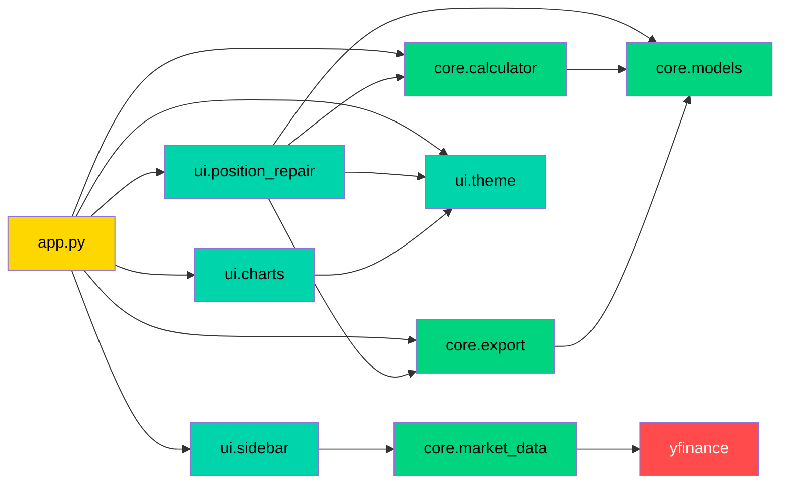
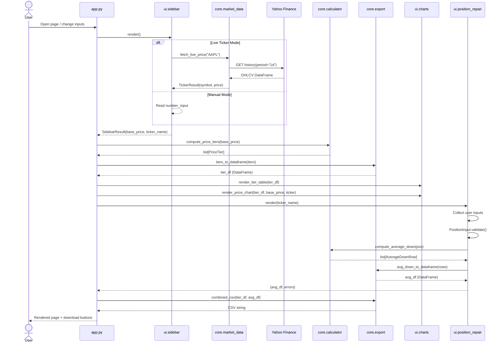
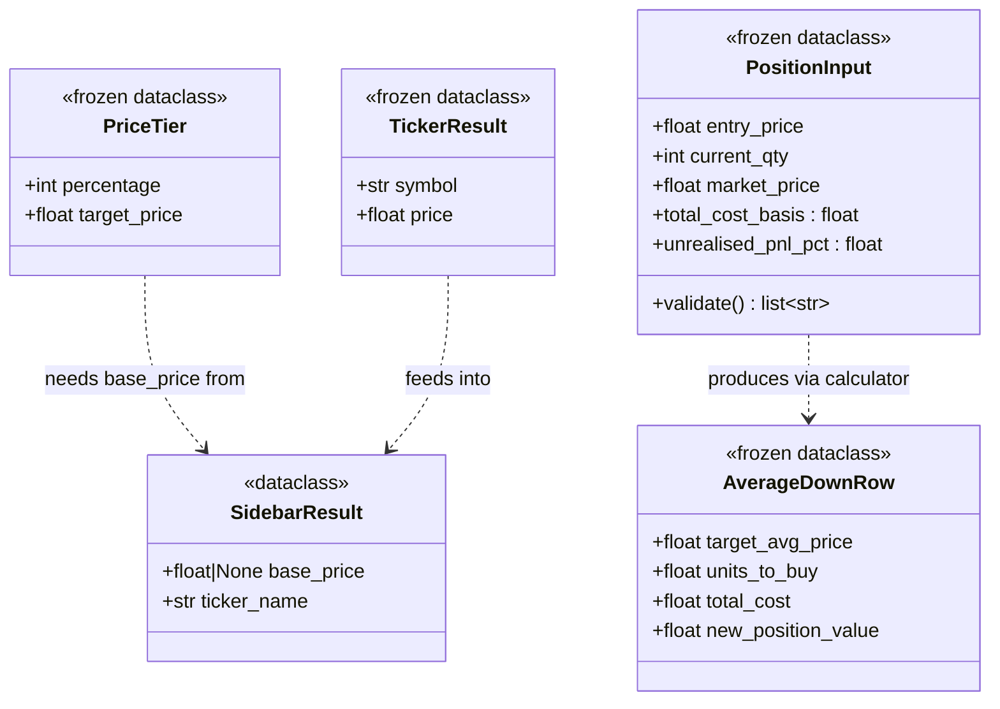
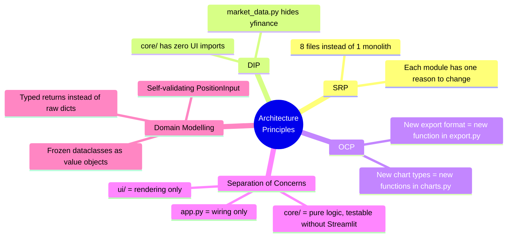
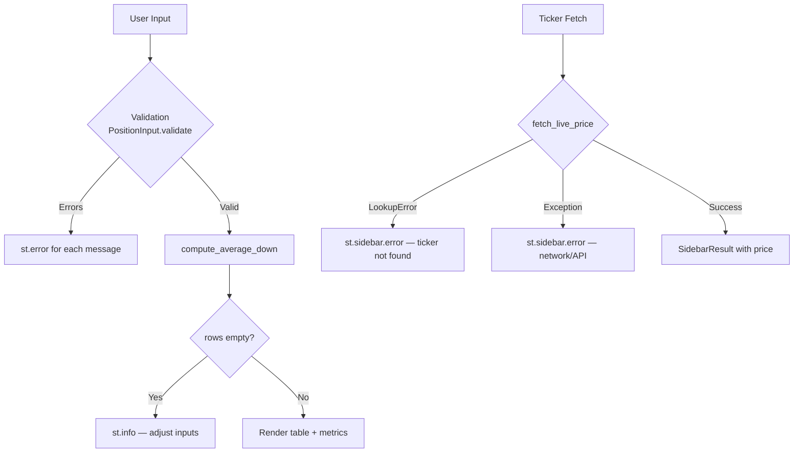

# The Break-Even Matrix — Technical Architecture Document

## 1. Overview

**The Break-Even Matrix** is a professional Streamlit web application for stock price
target visualization and average-down capital calculation. It enables traders and
investors to model price scenarios and determine the capital required to repair a
losing position via Dollar-Cost Averaging (DCA).

| Attribute        | Value                                        |
|------------------|----------------------------------------------|
| Runtime          | Python 3.11+                                 |
| Framework        | Streamlit ≥ 1.30                             |
| Charting         | Plotly ≥ 5.18                                |
| Market Data      | yfinance ≥ 0.2.30                            |
| Data Layer       | pandas ≥ 2.0                                 |
| Entry Point      | `app.py`                                     |

---

## 2. Directory Structure

```
BreakEven/
│
├── app.py                         # Orchestrator — ~65 LOC
│
├── core/                          # Domain Layer (zero UI deps)
│   ├── __init__.py
│   ├── models.py                  # Immutable value objects
│   ├── calculator.py              # Pure computation functions
│   ├── market_data.py             # External API gateway
│   └── export.py                  # DataFrame / CSV serialisation
│
├── ui/                            # Presentation Layer (Streamlit)
│   ├── __init__.py
│   ├── theme.py                   # Colour constants + CSS injection
│   ├── sidebar.py                 # Sidebar component
│   ├── charts.py                  # HTML table + Plotly chart
│   └── position_repair.py        # Average-down section
│
├── .streamlit/
│   └── config.toml                # Streamlit dark-theme config
│
└── requirements.txt
```

---

## 3. Layered Architecture Diagram

```mermaid
graph TB
    subgraph BROWSER["🌐 Browser"]
        USER["User"]
    end

    subgraph STREAMLIT["Streamlit Runtime"]
        APP["app.py<br/><i>Orchestrator</i>"]
    end

    subgraph UI_LAYER["ui/ — Presentation Layer"]
        THEME["theme.py<br/>Colour palette<br/>CSS injection"]
        SIDEBAR["sidebar.py<br/>SidebarResult"]
        CHARTS["charts.py<br/>HTML table<br/>Plotly chart"]
        REPAIR["position_repair.py<br/>Inputs · Metrics · Table"]
    end

    subgraph CORE_LAYER["core/ — Domain Layer"]
        MODELS["models.py<br/>PriceTier<br/>AverageDownRow<br/>PositionInput"]
        CALC["calculator.py<br/>compute_price_tiers()<br/>compute_average_down()"]
        EXPORT["export.py<br/>tiers_to_dataframe()<br/>avg_down_to_dataframe()<br/>combined_csv()"]
        MKTDATA["market_data.py<br/>fetch_live_price()"]
    end

    subgraph EXTERNAL["External Services"]
        YAHOO["Yahoo Finance API<br/>(yfinance)"]
    end

    USER -->|HTTP| APP
    APP --> THEME
    APP --> SIDEBAR
    APP --> CHARTS
    APP --> REPAIR
    APP --> CALC
    APP --> EXPORT

    SIDEBAR --> MKTDATA
    REPAIR --> CALC
    REPAIR --> EXPORT
    REPAIR --> MODELS

    CALC --> MODELS
    EXPORT --> MODELS
    MKTDATA --> YAHOO

    CHARTS --> THEME

    style CORE_LAYER fill:#1a2e1a,stroke:#00d47e,stroke-width:2px
    style UI_LAYER fill:#1a1f2e,stroke:#00d4aa,stroke-width:2px
    style BROWSER fill:#2d1a1a,stroke:#ff4b4b,stroke-width:1px
    style EXTERNAL fill:#2e2a1a,stroke:#ffd700,stroke-width:1px
```



---

## 4. Module Dependency Graph



**Legend:** 🟡 Orchestrator · 🟢 Core (pure) · 🔵 UI (Streamlit) · 🔴 External

---

## 5. Data Flow Sequence



---

## 6. Domain Model Class Diagram



---

## 7. Module Reference

### 7.1 `core/models.py` — Domain Value Objects

| Class            | Fields                                          | Purpose                              |
|------------------|-------------------------------------------------|--------------------------------------|
| `PriceTier`      | `percentage: int`, `target_price: float`        | One row of the price-tier table      |
| `AverageDownRow` | `target_avg_price`, `units_to_buy`, `total_cost`, `new_position_value` | One row of the DCA table |
| `PositionInput`  | `entry_price`, `current_qty`, `market_price`    | User's current losing position       |

`PositionInput` methods:
- **`validate() → list[str]`** — Returns a list of human-readable error messages (empty = valid).
- **`total_cost_basis`** (property) — `entry_price × current_qty`
- **`unrealised_pnl_pct`** (property) — Percentage loss from entry to current market.

### 7.2 `core/calculator.py` — Computation Engine

| Function                  | Signature                                          | Description                          |
|---------------------------|----------------------------------------------------|--------------------------------------|
| `compute_price_tiers`     | `(base_price: float) → list[PriceTier]`            | -100% to +500% in 5% steps          |
| `compute_average_down`    | `(pos: PositionInput) → list[AverageDownRow]`      | Solves DCA formula for each target   |
| `_resolve_targets`        | `(pos: PositionInput) → list[float]`               | Picks target averages dynamically    |

**DCA Formula:**
$$units\_to\_buy = \frac{(entry\_price \times qty) - (target\_avg \times qty)}{target\_avg - market\_price}$$

### 7.3 `core/market_data.py` — External Gateway

| Function            | Signature                            | Description                       |
|---------------------|--------------------------------------|-----------------------------------|
| `fetch_live_price`  | `(symbol: str) → TickerResult`       | Calls yfinance; raises `LookupError` on miss |

### 7.4 `core/export.py` — Serialisation

| Function              | Signature                                              | Description                        |
|-----------------------|--------------------------------------------------------|------------------------------------|
| `tiers_to_dataframe`  | `(tiers: list[PriceTier]) → DataFrame`                 | Converts tier list to pandas DF    |
| `avg_down_to_dataframe`| `(rows: list[AverageDownRow]) → DataFrame`            | Converts DCA rows to pandas DF    |
| `combined_csv`        | `(tier_df, avg_df=None) → str`                         | Merges both tables into one CSV   |

### 7.5 `ui/theme.py` — Design Tokens

| Constant               | Value       | Usage                  |
|-------------------------|-------------|------------------------|
| `COLOR_BG`              | `#0e1117`   | Page background        |
| `COLOR_BG_SECONDARY`    | `#1a1f2e`   | Card backgrounds       |
| `COLOR_ACCENT`          | `#00d4aa`   | Primary accent / chart  |
| `COLOR_SUCCESS`         | `#00d47e`   | Positive percentages    |
| `COLOR_DANGER`          | `#ff4b4b`   | Negative percentages    |
| `COLOR_GOLD`            | `#ffd700`   | Anchor / current price  |

### 7.6 `ui/sidebar.py` — Input Component

| Function  | Returns          | Description                                      |
|-----------|------------------|--------------------------------------------------|
| `render`  | `SidebarResult`  | Renders radio toggle + ticker/manual input        |

### 7.7 `ui/charts.py` — Visualisation

| Function              | Description                                              |
|-----------------------|----------------------------------------------------------|
| `render_tier_table`   | Colour-coded scrollable HTML table (green/red/bold anchor)|
| `render_price_chart`  | Plotly dark-theme line chart with gold anchor line         |

### 7.8 `ui/position_repair.py` — Average-Down Section

| Function  | Returns                           | Description                                  |
|-----------|-----------------------------------|----------------------------------------------|
| `render`  | `(DataFrame \| None, list[str])`  | Full section: inputs → validation → metrics → table → CSV button |

---

## 8. Design Principles Applied



---

## 9. Error Handling Strategy



| Boundary             | Guard                                  | User Feedback          |
|----------------------|----------------------------------------|------------------------|
| Sidebar ticker       | `try/except` around yfinance call      | `st.sidebar.error()`   |
| Position inputs      | `PositionInput.validate()` rules       | `st.error()` per rule  |
| DCA denominator      | `denom ≤ 0` → skip row                | Graceful row omission  |
| Empty result set     | `if not rows` check                    | `st.info()` guidance   |
| Streamlit min_value  | `min_value=0.01` on number inputs      | Widget-level guard     |

---

## 10. How to Run

```bash
# Install dependencies
pip install -r requirements.txt

# Launch the application
streamlit run app.py

# Access at http://localhost:8501
```
