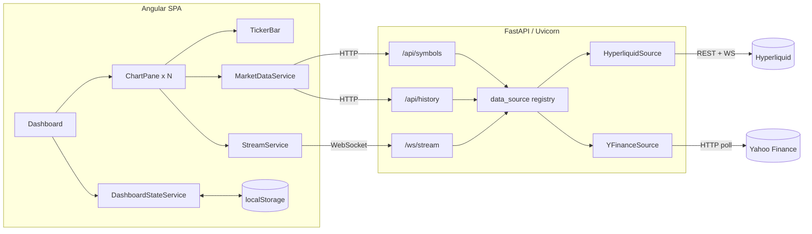

# 02 — Architecture

## High-level system

```
┌─────────────────────────────────────────────────────────────┐
│                        Browser (Angular SPA)                  │
│                                                               │
│  Dashboard ──┬── ChartPane #1 ──┐                             │
│              ├── ChartPane #2   │  each pane:                 │
│              ├── ...            │   • REST history (HTTP)     │
│              └── ChartPane #N ──┘   • live stream (WebSocket) │
│                                     • TickerBar (flash)       │
└───────────────┬───────────────────────────┬──────────────────┘
                │ HTTP (REST)                │ WebSocket
                ▼                            ▼
┌─────────────────────────────────────────────────────────────┐
│                     FastAPI backend (Uvicorn)                 │
│                                                               │
│  /api/symbols   /api/history        /ws/stream                │
│       │              │                   │                    │
│       └──────────────┴───────────────────┘                   │
│                      ▼                                         │
│              data_source.py  (registry + resolver)            │
│             ┌────────────────┬─────────────────┐              │
│             ▼                ▼                                 │
│     HyperliquidSource   YFinanceSource                        │
└─────────────┬────────────────┬───────────────────────────────┘
              │ REST + WS       │ HTTP (threaded) + polling
              ▼                 ▼
        Hyperliquid API     Yahoo Finance (yfinance)
```

## Mermaid component diagram



## Data flow

### 1. Symbol discovery (on app load)
1. `Dashboard` calls `MarketDataService.getSymbols()` → `GET /api/symbols`.
2. Backend aggregates `list_symbols()` from every registered source, grouped by
   asset class.
3. The grouped list populates each pane's symbol dropdown.

### 2. Historical load (per pane, on symbol/interval change)
1. `ChartPane` calls `MarketDataService.getHistory(symbol, interval)` →
   `GET /api/history`.
2. Backend resolves the owning source and calls `get_history(...)`.
3. Candles are returned oldest-first and rendered via
   `series.setData(...)`, then `timeScale().fitContent()`.

### 3. Live streaming (per pane)
1. `ChartPane` opens `StreamService.connect(symbol, interval)` → a WebSocket to
   `/ws/stream`.
2. Client sends `{"action":"subscribe","symbol","interval"}`.
3. Backend resolves the source and pumps its `stream(...)` async generator.
4. For each upstream update the backend emits:
   - `{"type":"candle",...}` → `series.update(...)` redraws the latest bar.
   - `{"type":"tick",...}` → updates the `TickerBar` price and flash color.

### 4. Persistence
- `DashboardStateService` holds the config in a signal and uses an `effect()` to
  write to `localStorage` on every change. On startup it restores and validates
  the saved config (falling back to defaults if invalid).

## Key design decisions

### Pluggable async data architecture
All provider specifics (transport, auth, parsing) sit behind a single
`DataSource` abstract base class. The rest of the app only knows the abstract
contract, so adding a provider never touches routing, models, or the frontend.
See [09 — Extending](09-extending-data-sources.md).

### One WebSocket per pane
Each chart owns an independent socket scoped to one symbol/interval. This keeps
the bridge simple (no multiplexing/fan-out logic) and makes pane teardown clean:
unsubscribing closes exactly one socket and cancels exactly one server-side pump
task.

### Sync providers off the event loop
`yfinance` is blocking and has no streaming socket. Blocking calls run in a
thread pool via `asyncio.to_thread(...)`, and "live" behavior is emulated by
polling on an interval — so the async event loop is never blocked.

### Same typed contract on both sides
Pydantic models (`backend/app/models.py`) and TypeScript interfaces
(`frontend/src/app/models/market.ts`) mirror each other, giving an end-to-end
typed wire format.

### Runtime URL resolution
The frontend resolves API/WS base URLs at runtime: empty env bases mean
"same origin," so the identical production build works whether the SPA is served
by FastAPI (unified service) or by a separate static host.

## Concurrency model

- **Backend:** fully async. Each WebSocket connection runs a background
  `_pump` task created with `asyncio.create_task` and cancelled on disconnect.
  Crypto streaming uses a reconnecting `websockets.connect` loop; stock streaming
  uses an interval poll that offloads blocking work to threads.
- **Frontend:** zoneless Angular with signals. Each pane manages its own RxJS
  subscriptions and tears them down via `takeUntilDestroyed` / `DestroyRef`.
