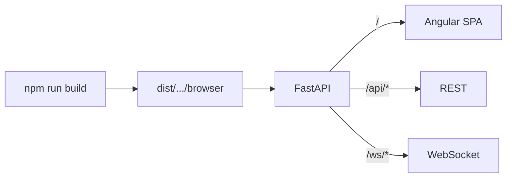

# 08 — Deployment

The app is designed to deploy as a **single unified web service**: FastAPI
serves the compiled Angular SPA while also exposing the API and WebSocket. This
fits free tiers that allow only one web instance.

## How the unified service works

1. Angular is built → `frontend/dist/live-dashboard/browser/`.
2. `FRONTEND_DIST` points the backend at that folder.
3. On startup, FastAPI mounts it at `/` (after the `/api` and `/ws` routes).
4. One Uvicorn process serves everything on `$PORT`.



---

## Option A — Docker (Render, Fly.io, Hugging Face Spaces)

The multi-stage [`Dockerfile`](../Dockerfile):
- **Stage 1** (`node:22-alpine`): `npm ci` + `npm run build`.
- **Stage 2** (`python:3.12-slim`): installs backend deps, copies the backend
  and the built SPA, and runs Uvicorn bound to `$PORT`.

```bash
docker build -t live-dashboard .
docker run -p 8000:8000 live-dashboard
# open http://localhost:8000
```

The image sets `FRONTEND_DIST=/app/frontend/dist/live-dashboard/browser` so the
SPA is served automatically.

---

## Option B — Render (blueprint)

[`render.yaml`](../render.yaml) defines a Docker web service on the **free**
plan with a health check on `/api/health`.

1. Push the repo to GitHub.
2. In Render: **New → Blueprint**, select the repo.
3. Render reads `render.yaml`, builds the Dockerfile, and deploys.

Environment variables are pre-set in the blueprint (`HOST`, `CORS_ORIGINS`,
`FRONTEND_DIST`, `POLL_INTERVAL_SECONDS`, `RELOAD`). Adjust `CORS_ORIGINS` to
your final domain if you lock it down.

---

## Option C — Railway / Heroku-style (`Procfile`)

[`Procfile`](../Procfile):
```
web: cd backend && uvicorn app.main:app --host 0.0.0.0 --port $PORT
```

Build the frontend first so the backend can serve it:
```bash
cd frontend && npm run build
```
Then deploy. Ensure `FRONTEND_DIST` resolves to the built SPA path on the
platform (the default relative path works when the repo layout is preserved).

---

## Option D — Fly.io

Fly uses the Dockerfile directly:
```bash
fly launch          # detects the Dockerfile; sets internal port to 8000
fly deploy
```
Set the internal port to `8000` (or expose `$PORT`) in `fly.toml`.

---

## Option E — Hugging Face Spaces (Docker SDK)

1. Create a **Docker** Space.
2. Push the repo (the root `Dockerfile` is used automatically).
3. Spaces exposes port `7860` by default — either set `PORT=7860` or update the
   Dockerfile `CMD`/`EXPOSE` accordingly.

---

## Separate frontend + backend (alternative)

You can also host them apart (e.g. static SPA on a CDN + API on a PaaS):

1. Backend: deploy with `FRONTEND_DIST` unset/non-existent (API-only). Set
   `CORS_ORIGINS` to the SPA origin.
2. Frontend: set `apiBase`/`wsBase` in `environment.ts` to the API origin,
   `npm run build`, and upload `dist/live-dashboard/browser/` to the host.

---

## Production checklist

- [ ] `RELOAD=0`.
- [ ] `CORS_ORIGINS` set to your real origin(s), not `*`, if exposing publicly.
- [ ] `FRONTEND_DIST` resolves to the built SPA (unified) **or** is disabled
      (split hosting).
- [ ] Platform `$PORT` honored (Dockerfile/Procfile already do this).
- [ ] Health check path set to `/api/health`.
- [ ] HTTPS terminated by the platform → frontend auto-upgrades WS to `wss:`.

## Notes on free-tier behavior

- Free instances often **sleep when idle**; the first request after sleep is
  slow (cold start). The `/api/health` check keeps platforms informed.
- Long-lived WebSockets may be recycled by the platform; the crypto source
  reconnects automatically, and the frontend re-subscribes on reconnect via
  pane re-render.
